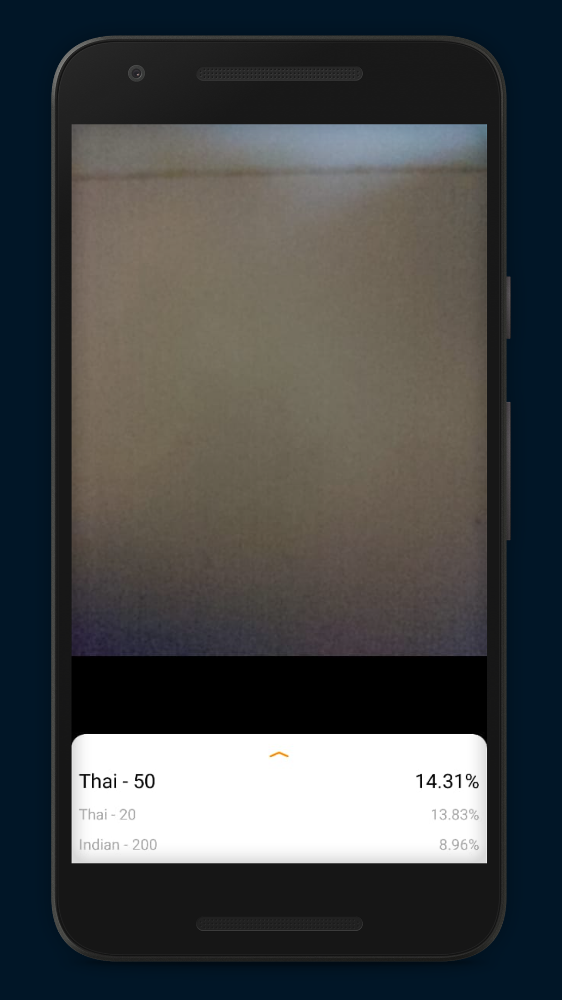
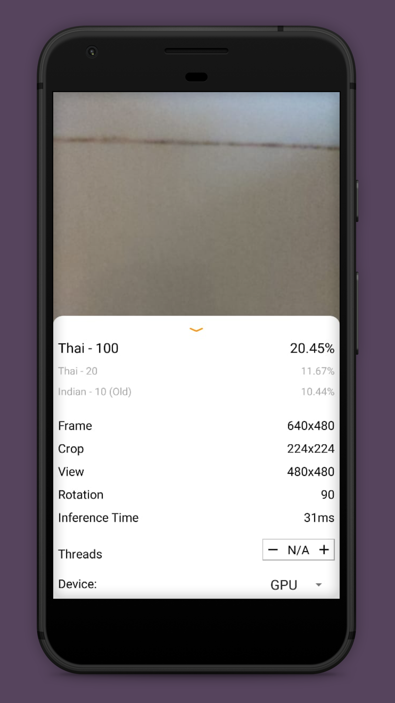

# Fake-Detection

There is a lot of fake currency in our world used for nefarious tasks. However, it's not big leaders that get affected but rather common people who just want to get by in their lives. They also don’t have access to big banks. Hence I made a fake bill detector that could detect fake currency using their phones. It is an android application that uses Java, Python and a library tensorflow to compile. It was made in an android environment to ensure it can reach 99% of the people.

## Further Exploration

Convert the Android App to a Flutter based app so it can be used with Apple devices too. 

## Live Testing

## Screenshots

